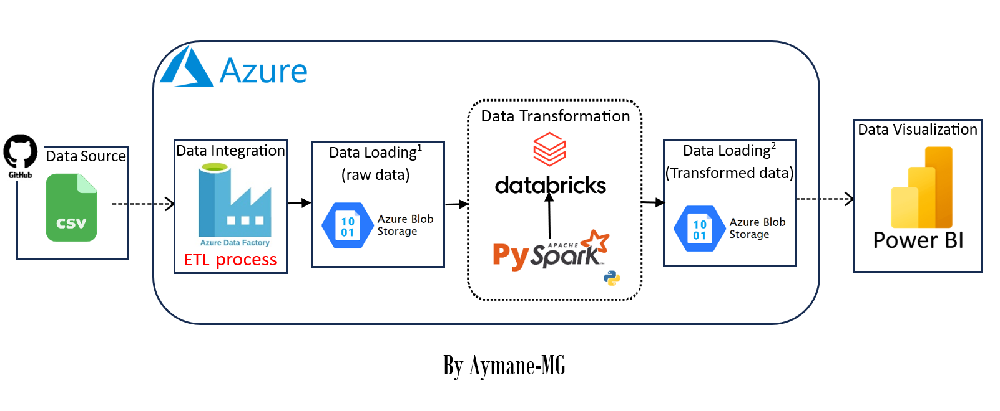
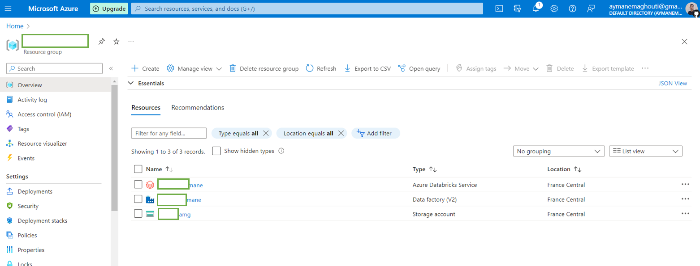
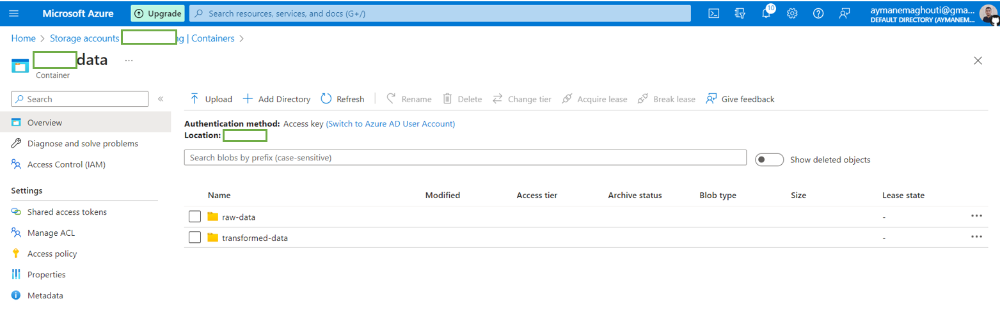
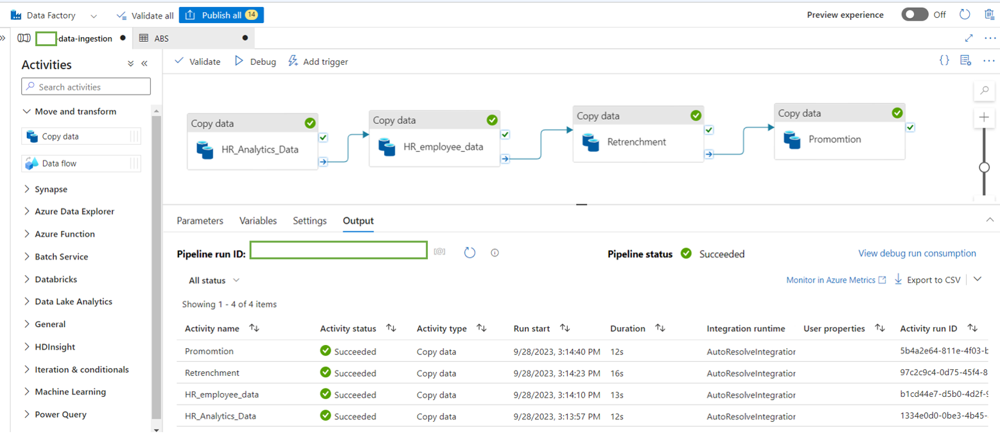
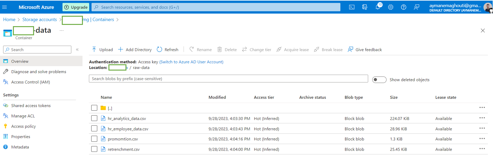
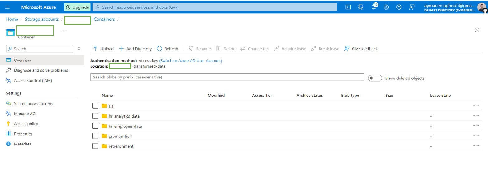
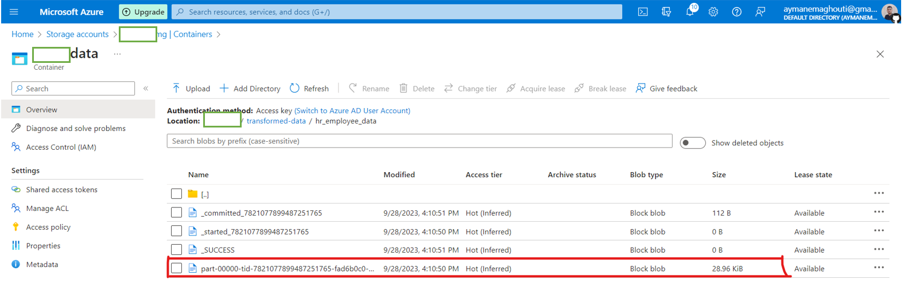
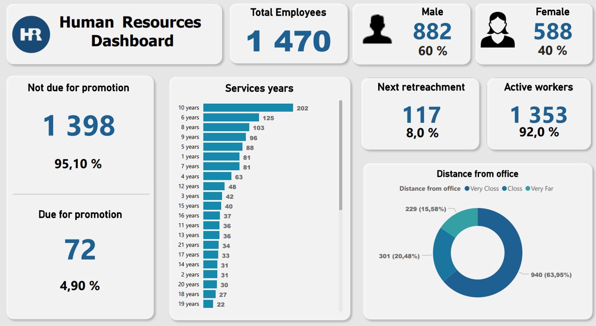

# Human Resources ETL Project

## Table of Contents
1. [Project Overview](#project-overview)
3. [Technologies Used](#technologies-used)
4. [Data Pipeline](#data-pipeline)
5. [Repository Structure](#repository-structure)
6. [How to Run](#how-to-run)
7. [Dashboard](#dashboard)
8. [Acknowledgments](#acknowledgments)
9. [Conclusion](#conclusion)
10. [Contacts](#contacts)

# Project Overview
This project is a comprehensive data engineering solution that extracts HR data from a GitHub repository, performs data transformations using Azure services, and creates an interactive HR dashboard using Power BI. The goal is to enable HR professionals and decision-makers to gain insights from the HR data for better workforce management.

# Technologies Used
- **Azure Data Factory**: Used for orchestrating data extraction and loading processes.
- **Azure Blob Storage**: Used as the data storage solution.
- **Azure Databricks (PySpark)**: Used for data transformation, leveraging the power of PySpark for processing.
- **Power BI**: Used for data visualization and dashboard creation.
- **GitHub**: Hosting the raw HR data.


# Data Pipeline

Here is the HR data pipeline :



The data pipeline consists of the following stages:

1. **Extract from GitHub Repository**: Azure Data Factory is configured to  extract HR data from a specified GitHub repository.

2. **Load to Azure Blob Storage**: Extracted data is loaded into Azure Blob Storage for storage.

3. **Transform Data with Azure Databricks**: Azure Databricks, powered by PySpark, is used to perform data transformations.

4. **Power BI Dashboard**: Power BI connects to Azure Blob Storage and retrieves the transformed data. Power Query is used for additional data transformations within Power BI. The HR dashboard is created to provide interactive visualizations and insights into the HR data.

# Repository Structure

```bash
HR-Data-Pipeline-Azure:.
│   README.md
│
├───dataset
│       HR Analytics Data.csv
│       HR employee data.csv
│       promomtion.csv
│       Retrenchment.csv
│
├───images
│       container.png
│       dashboard_hr.png
│       data_pipeline_data_factory.png
│       exemple-transformed-data.png
│       raw-data.png
│       services_azure.png
│       transformed-data.png
│       workflow_hr.png
│
└───Main
        DataBricks_noteBook.ipynb
        HR_Dashboard.pbix
        Power_BI _HR_Dashboard.pdf

```


# How to Run

#### Prerequisites
Before running this project, ensure you have the following prerequisites in place:

- **Azure Subscription**: You should have an active Azure subscription for using Azure services.
- **GitHub Account**: Access to the GitHub repository containing the HR data.
- **Azure Data Factory**: Set up an Azure Data Factory instance with appropriate permissions to create and manage pipelines.
- **Azure Databricks**: Provision an Azure Databricks workspace and configure it for data transformation with PySpark.
- **Power BI Desktop**: Install Power BI Desktop for editing and viewing the HR dashboard.

Here is the Azure services that I used :




#### Azure blob storage 

create the two folders in your container (raw-data folder for the data comes from the github repo (data source) , transformed-data folder for the transformed data (data destination)).



#### Azure data Factory 

Here is the data pipeline created in azure data Factory :



after running the data pipeline, the data will be loaded into the raw-data folder :




#### Notebook Configuration
To configure the notebooks for data transformation in Azure Databricks, follow these steps:

1. Open the PySpark notebooks in the `Main/` directory.
2. Update the following parameters in the notebooks with your Azure account information:
   - **Client ID**: Replace with your Azure Active Directory (AAD) Application Client ID.
   - **Secret Key**: Replace with your AAD Application Secret Key.
   - **Directory (Tenant) ID**: Replace with your AAD Directory (Tenant) ID.
   - **Container Name**: Set the name of the Azure Blob Storage container where the data will be stored.
   - **Storage Account Name**: Specify the name of your Azure Storage Account.

Make sure to securely manage and store these credentials. (in my case I just put them in the notebook which is not the best practice :), so you can use the azure key vault service to manage the credentials).

after running the script the transformed data will be loaded into the transformed-data folder inside the container :



and here is an example of the data loaded, the file framed in red is the actual data, the other files are just meta-data...




#### Cleaning Up (Data in Azure)
Cleaning up resources is Optionally:

1. **Azure Blob Storage**: Delete the Azure Blob Storage container used for storing intermediate and transformed data.
2. **Azure Data Factory**: delete any Azure Data Factory pipelines used for data extraction and loading.
3. **Azure Databricks**: Terminate any running clusters in Azure Databricks.

#### Power Bi connect  
Set up Power BI to connect to Azure Blob Storage and open the provided `.pbix` file in the `Main/` directory.

# Dashboard
Here is the HR Dashboard created in Power BI:



# Acknowledgments
- Special thanks to the open-source communities behind `azure cloud` ,`Python`, and `Power BI` for providing powerful tools for data extraction, transformation, orchestration, and visualization.

# Conclusion
This project demonstrates an end-to-end data engineering solution for HR data analysis using Azure services. It streamlines data extraction, transformation, and visualization to provide actionable insights.

# Contacts
For any questions or further information, feel free to contact me :)

- **linkedin**: <a href="https://www.linkedin.com/in/aymane-maghouti/" target="_blank">Aymane Maghouti</a><br>
- **Email**: `aymanemaghouti@gmail.com`


